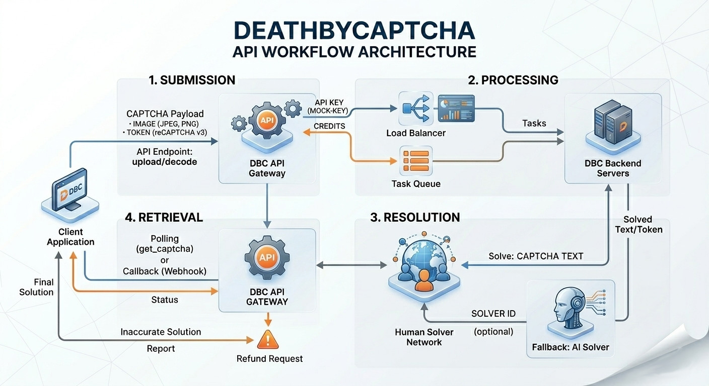

<div align="center">

<a href="https://deathbycaptcha.com"></a>

### The Professional Bypass Captcha Service & Captcha Solver for Bots

[](https://deathbycaptcha.com)
[](https://deathbycaptcha.com/api)
[](https://deathbycaptcha.com/contact)
[](https://deathbycaptcha.com/)

</div>

---

## What is DeathByCaptcha?

DeathByCaptcha.com offers a powerful **[captcha solver](https://deathbycaptcha.com) that helps developers** efficiently **[bypass captchas](https://deathbycaptcha.com/api)** and streamline automation without compromising performance.

It's designed to handle a wide range of challenges, including [reCAPTCHA](https://deathbycaptcha.com/api/newtokenrecaptcha), image-based puzzles, and more. Whether you're building scripts, scraping data, running automated tests, or scaling web-based operations, our [captcha solver API](https://deathbycaptcha.com/api) delivers fast, accurate, and reliable results.

- ✅ **21+ CAPTCHA types** supported — image, reCAPTCHA v2/v3, Turnstile, Amazon WAF, GeeTest, hCaptcha, and more
- ✅ **HTTP & Socket API** — choose the transport that fits your use case
- ✅ **Official client libraries** in 9+ languages — drop-in, production-ready
- ✅ **24/7 human & automated solving** — sub-15-second average response time
- ✅ **Token-based auth** for CI/CD and headless environments
- ✅ **99.9% uptime SLA** and battle-tested in high-volume production workloads

---

## Official API Client Libraries

| Language | Repository | Install | Docs |
|:---:|---|---|---|
| <br>**Python** | [deathbycaptcha-api-client-python](https://github.com/deathbycaptcha/deathbycaptcha-api-client-python) | `pip install deathbycaptcha` | [README](https://github.com/deathbycaptcha/deathbycaptcha-api-client-python#readme) |
| <br>**Go** | [deathbycaptcha-api-client-go](https://github.com/deathbycaptcha/deathbycaptcha-api-client-go) | `go get github.com/deathbycaptcha/deathbycaptcha-api-client-go/v4` | [README](https://github.com/deathbycaptcha/deathbycaptcha-api-client-go#readme) |
| <br>**Node.js** | [deathbycaptcha-api-client-nodejs](https://github.com/deathbycaptcha/deathbycaptcha-api-client-nodejs) | `npm install deathbycaptcha` | [README](https://github.com/deathbycaptcha/deathbycaptcha-api-client-nodejs#readme) |
| <br>**PHP** | [deathbycaptcha-api-client-php](https://github.com/deathbycaptcha/deathbycaptcha-api-client-php) | `composer require deathbycaptcha/deathbycaptcha` | [README](https://github.com/deathbycaptcha/deathbycaptcha-api-client-php#readme) |
| <br>**Java** | [deathbycaptcha-api-client-java](https://github.com/deathbycaptcha/deathbycaptcha-api-client-java) | Maven | [README](https://github.com/deathbycaptcha/deathbycaptcha-api-client-java#readme) |
| <br>**.Net (C#, VB)** | [deathbycaptcha-api-client-dotnet](https://github.com/deathbycaptcha/deathbycaptcha-api-client-dotnet) | NuGet package | [README](https://github.com/deathbycaptcha/deathbycaptcha-api-client-dotnet#readme) |
| <br>**C++** | [deathbycaptcha-api-client-cpp](https://github.com/deathbycaptcha/deathbycaptcha-api-client-cpp) | CMake | [README](https://github.com/deathbycaptcha/deathbycaptcha-api-client-cpp#readme) |
| <br>**C (C11)** | [deathbycaptcha-api-client-c11](https://github.com/deathbycaptcha/deathbycaptcha-api-client-c11) | CMake | [README](https://github.com/deathbycaptcha/deathbycaptcha-api-client-c11#readme) |
| <br>**Perl** | [deathbycaptcha-api-client-perl](https://github.com/deathbycaptcha/deathbycaptcha-api-client-perl) | `cpanm --installdeps .` | [README](https://github.com/deathbycaptcha/deathbycaptcha-api-client-perl#readme) |

> All libraries implement similar `Client` interface with `HTTP` and `Socket` transports,
> support authentication via `username`/`password` **or** `authtoken`.

---

## Supported CAPTCHA Types

| # | Type | Description |
|:---:|---|---|
| 0 | 🖼️ **Image CAPTCHA** | Classic text-in-image challenges |
| 4 | 🔁 **reCAPTCHA v2** | Google checkbox reCAPTCHA |
| 5 | 📊 **reCAPTCHA v3** | Score-based invisible reCAPTCHA |
| 8 | 🧩 **GeeTest v3** | Slide & behavior-based CAPTCHA |
| 9 | 🧩 **GeeTest v4** | Next-gen GeeTest challenges |
| 11 | 📝 **TextCaptcha** | Text-based question CAPTCHA |
| 12 | ☁️ **Cloudflare Turnstile** | Cloudflare's privacy-preserving challenge |
| 13 | 🎵 **Audio Captcha** | Voice/audio challenges |
| 14 | 🍋 **Lemin Cropped** | Cropped puzzle CAPTCHA |
| 15 | 🧸 **Capy Puzzle** | Jigsaw puzzle CAPTCHA |
| 16 | 🛡️ **Amazon WAF** | AWS bot protection token |
| 17 | 🤖 **Cyber Siara** | Behavioral slide CAPTCHA |
| 18 | 🔒 **Mtcaptcha** | MTCaptcha enterprise challenges |
| 19 | ✂️ **Cutcaptcha** | Drag & drop image CAPTCHA |
| 20 | 😊 **Friendly Captcha** | Eco-friendly PoW CAPTCHA |
| 21 | 🟣 **Datadome** | DataDome bot protection |
| 23 | 🇨🇳 **Tencent Captcha** | Tencent TDC slider |
| 24 | 🚦 **Atb Captcha** | ATB bot challenge |
| 25 | 🏢 **reCAPTCHA v2 Enterprise** | Google reCAPTCHA v2 Enterprise |

---

## Quick Start

```python
# Python — solve a reCAPTCHA v2 in 3 lines
import deathbycaptcha
client = deathbycaptcha.HttpClient("your_username", "your_password")
result = client.decode(None, 120, {
    "type": "1",
    "googlekey": "6Le-wvkSAAAAAPBMRTvw0Q4Muexq9bi0DJwx_mJ-",
    "pageurl": "https://example.com"
})
print(result["text"])  # reCAPTCHA token
```

```go
// Go — bypass captcha service with automatic polling
client := deathbycaptcha.NewHttpClient("your_username", "your_password")
result, _ := client.Decode(nil, 120, map[string]string{
    "type":      "1",
    "googlekey": "6Le-wvkSAAAAAPBMRTvw0Q4Muexq9bi0DJwx_mJ-",
    "pageurl":   "https://example.com",
})
fmt.Println(*result.Text) // reCAPTCHA token
```

```js
// Node.js — captcha solver for bots
const dbc = require("deathbycaptcha");
const client = new dbc.HttpClient("your_username", "your_password");
const result = await client.decode(null, 120, {
    type: 1,
    googlekey: "6Le-wvkSAAAAAPBMRTvw0Q4Muexq9bi0DJwx_mJ-",
    pageurl: "https://example.com",
});
console.log(result.text); // reCAPTCHA token
```

---

## How It Works

### Streamlined CAPTCHA Solving Workflow

DeathByCaptcha's architecture is engineered for **high-performance captcha solving** with minimal latency. Our **API-driven approach** simplifies integration across web scraping, automated testing, authentication bypass, and bot automation scenarios.

**The Three-Step Process:**

1. **Submit Your CAPTCHA** — Send image bytes, reCAPTCHA sitekey + pageurl, hCaptcha credentials, or any supported challenge type via HTTP or persistent Socket connection
2. **Intelligent Processing** — Our **solving engine** processes requests through a hybrid network of 24/7 human solvers and AI-powered automation, delivering results in **sub-15 seconds average**
3. **Receive Your Token** — Get the CAPTCHA solution (token, text, or coordinates) and inject directly into your **automation workflow**

<div align="center">



</div>

**Why Choose DeathByCaptcha's Solving API:**
- ⚡ **Low-latency processing** — average 8-15 second response time
- 🔄 **Automatic polling** — client libraries handle retry logic
- 🛡️ **Enterprise-grade reliability** — 99.9% uptime SLA
- 🌍 **Global solving network** — distributed infrastructure for optimal performance
- 💪 **21+ CAPTCHA type support** — single API for all challenge types

---

## Resources

| Resource | Link |
|---|---|
| 🌐 Website | https://deathbycaptcha.com |
| 📖 API Documentation | https://deathbycaptcha.com/api |
| 💰 Pricing | https://deathbycaptcha.com/ |
| 🔑 Dashboard / Login | https://deathbycaptcha.com/login#login-form |
| 📬 Contact & Support | https://deathbycaptcha.com/contact |
| 🤖 AI Agents API Metadata | [deathbycaptcha-agent-api-metadata](https://github.com/deathbycaptcha/deathbycaptcha-agent-api-metadata) |

---

<div align="center">

**© 2010 – 2026 [DeathByCaptcha](https://deathbycaptcha.com/) · Trusted bypass captcha service for developers worldwide**

[](https://github.com/deathbycaptcha/deathbycaptcha-api-client-python)
[](https://github.com/deathbycaptcha/deathbycaptcha-api-client-go)
[](https://github.com/deathbycaptcha/deathbycaptcha-api-client-nodejs)
[](https://github.com/deathbycaptcha/deathbycaptcha-api-client-php)
[](https://github.com/deathbycaptcha/deathbycaptcha-api-client-java)
[](https://github.com/deathbycaptcha/deathbycaptcha-api-client-dotnet)
[](https://github.com/deathbycaptcha/deathbycaptcha-api-client-cpp)
[](https://github.com/deathbycaptcha/deathbycaptcha-api-client-c11)
[](https://github.com/deathbycaptcha/deathbycaptcha-api-client-perl)

</div>
